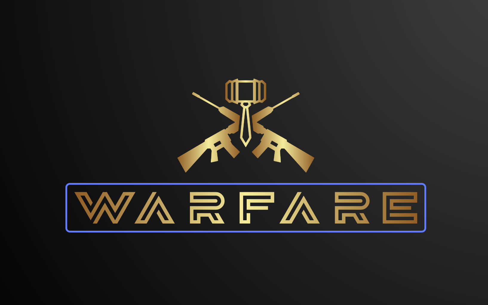

# Warfare



A modern HTML5 remake of **Warfare 1.0** (1995) by Carric Moor Games. Turn-based hex strategy with city management, unit recruitment, tactical combat, and AI opponents — all running in the browser with zero dependencies.

## Play

```bash
cd warfare
python3 -m http.server 8000
# Open http://localhost:8000
```

No build step. No frameworks. Just vanilla HTML5 + Canvas + ES Modules.

## Features

- **Hex grid map** — procedurally generated continent with islands, bridges, and varied terrain (plains, hills, forests, mountains, swamps)
- **50+ cities** — configurable count (20-80), each with population, economics, defense, knowledge, satisfaction, and garrison stats
- **7 unit types** — Commander, Scout, Raider, Army Corps, Artillery, Mechanized, Defender — each with unique movement, combat stats, and terrain costs
- **Tactical combat** — unit-type matchup matrix, terrain bonuses, city fortification, equipment capture, truce/surrender mechanics
- **Economy** — tax collection, investment allocation across 4 sectors, city growth, revolt system
- **AI opponents** — 4 personality types: Genteel, Aggressive, Insane, Benevolent
- **Unit management** — recruitment, replenishment, splitting, merging, troop transfers, standing orders

## Quick Reference

| Unit | Move | ATK | DEF | Cost | Role |
|------|------|-----|-----|------|------|
| Commander | 3 | 2 | 10 | - | Leader. Death = elimination. |
| Scout | 15 | 1 | 1 | 60g | Fast recon. Views city stats. |
| Defender | 0 | 2 | 8 | 50g | Cheap garrison. Cannot leave city. |
| Army Corps | 7 | 7 | 7 | 100g | Balanced front-line troops. |
| Raider | 12 | 6 | 3 | 200g | Fast strike force. |
| Artillery | 4 | 3 | 9 | 300g | City defense specialist. |
| Mechanized | 5 | 9 | 3 | 350g | Negates fortification. |

## Documentation

Detailed docs for each game system:

- [Units & Combat](docs/units-and-combat.md) — unit types, stats, movement, terrain costs, combat matchups, capture mechanics
- [Technology](docs/technology.md) — 12 tech tiers from Primitive to Transcendent, knowledge growth, unit tech bonuses, notifications
- [Cities & Economy](docs/cities-and-economy.md) — city attributes, taxes, investment, growth, revolts, recruitment
- [Orders & Movement](docs/orders-and-movement.md) — standing orders, move-to system, animated movement, pathfinding
- [AI Opponents](docs/ai-opponents.md) — personality types, decision logic, behavior patterns
- [Controls](docs/controls.md) — mouse, keyboard, right-click menus, info panel, menu bar

## Architecture

```
warfare/
├── index.html          # Single page app shell
├── css/warfare.css     # All styling
├── js/
│   ├── main.js         # Entry point, game loop, UI wiring
│   ├── config.js       # Constants, balance values, combat matrix
│   ├── hex.js          # Hex math (axial coords, neighbors, distance)
│   ├── map.js          # Continent + island generation, terrain, cities
│   ├── renderer.js     # Canvas drawing (grid, terrain, cities, units, HUD)
│   ├── camera.js       # Viewport pan, scroll, bounds clamping
│   ├── input.js        # Mouse/keyboard, hex click, pathfinding, animation
│   ├── city.js         # City model and attribute generation
│   ├── unit.js         # Unit creation, recruitment, management
│   ├── player.js       # Player model, treasury, income
│   ├── combat.js       # Combat resolution, matchups, capture, truce/surrender
│   ├── ai.js           # AI decision engine, 4 personalities
│   ├── turn.js         # Turn manager, phase sequencing, auto-movement
│   ├── investment.js   # Tax/investment, city growth, revolt logic
│   ├── orders.js       # Unit orders system (attack, hold, dig-in, move-to, etc.)
│   ├── ui.js           # Menu bar, dialogs, panels
│   ├── save.js         # Save/load (planned)
│   └── utils.js        # Seeded RNG, helpers
├── assets/             # Logo and images
└── docs/               # Detailed game documentation
```

## Origins

Warfare 1.0 was a Windows 3.1 turn-based strategy game released in 1995. This remake preserves the core gameplay — hex grid, city economics, 7 unit types, AI personalities — while modernizing the interface for the browser. If the HTML5 version plays well, a standalone desktop version (Rust/egui) may follow.

## License

MIT
